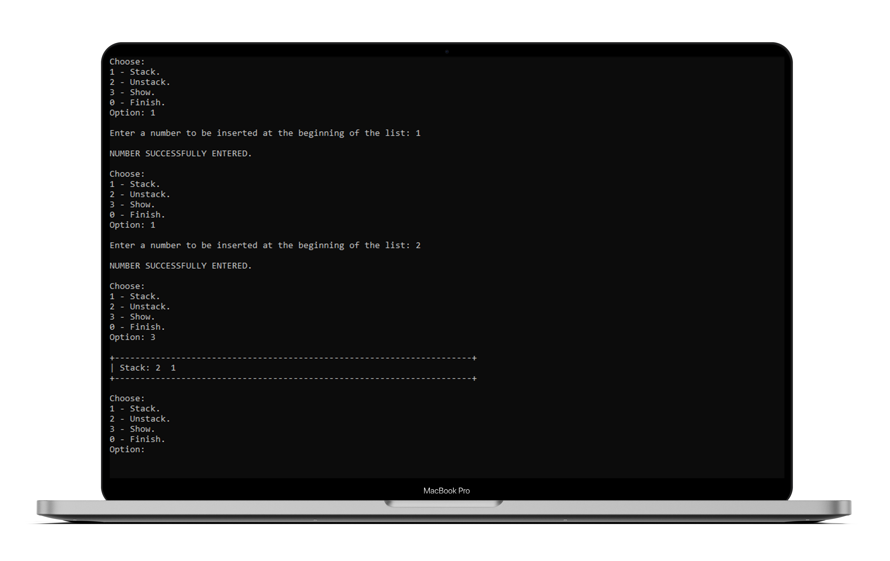

<h1 align="center"> Pilha em C </h1>

    <a title="Sobre" href="#-sobre">Sobre</a>&nbsp;&nbsp;•&nbsp;&nbsp;  
    <a title="Funcionalidades" href="#%EF%B8%8F-funcionalidades">Funcionalidades</a>&nbsp;&nbsp;•&nbsp;&nbsp;
    <a title="Tecnologias" href="#-tecnologias-utilizadas">Tecnologias</a>&nbsp;&nbsp;•&nbsp;&nbsp;
    <a title="Funcionamento" href="#-funcionamento">Funcionamento</a>&nbsp;&nbsp;•&nbsp;&nbsp;
    <a title="path" href="#-acesso-ao-projeto">path</a>&nbsp;&nbsp;•&nbsp;&nbsp;
    <a title="Autor" href="#-desenvolvedor">Autor</a>

    &nbsp;
    &nbsp;
    

 

    

### ✔️ Status: Concluído

## 🔎 Sobre

Para uma perfeita compreensão deste projecto é necessário ter algum conhecimento prévio de Lista simplesmente encadeada. No meu perfil existe um repositório que cobre este assunto.

O programa consiste numa estrutura de dados que armazena dados na ordem LIFO (Last In First Out). Em outras palavras, o último elemento a entrar na cadeia é o primeiro a sair quando esta é removida. Para isso, é necessário apenas um ponteiro para controlar a entrada e saída de elementos.
Para o programa atual, deve basear-se na ideia de que não serão inseridos números repetidos.

## ⚒️ Funcionalidades

O programa deve possuir as seguintes funções:

* Empilhar
* Desempilhar
* Mostrar
* Finalizar

## 🚀 Tecnologias utilizadas
<table>
    <tr>
        <td>C</td>
    </tr>
</table>

## 📷 Funcionamento

    

## 📂 Acesso ao projeto 

Acesse a pasta do projeto clicando <a href="https://github.com/mmmello/Stack-in-C/tree/main/src">aqui</a>.

## 💻 Desenvolvedor
Matheus Mello, 2022
 
 

<i><h4 align="center">"Investir em conhecimento sempre renderá os melhores juros" 💭</h4></i>